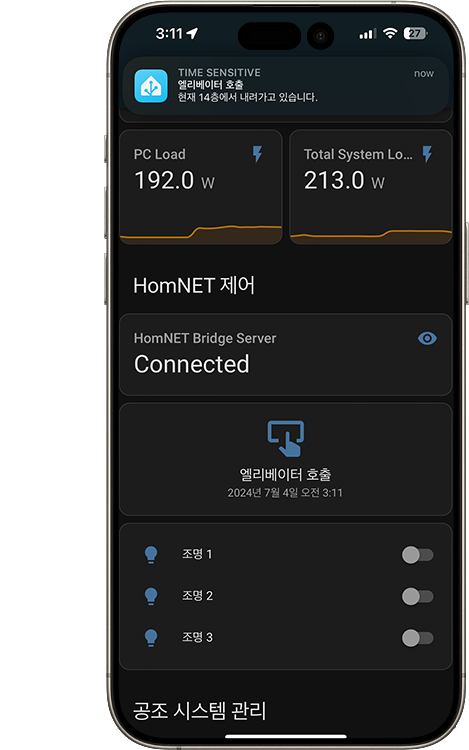

# HomNetBridge-Serial
 

이 프로젝트는 구형 LG HomNet 기반 스마트 홈 시스템 월패드의 RS485 통신을 캡쳐하여 Home Assistant에 통합하는 프로젝트입니다.



### Table of Contents
- [Features](#features)
- [Requirements](#requirements)
- [Run project](#run-project)

## Features
EW11 시리얼 어뎁터를 통해 직접 패킷을 송수신 하여 아래의 기능을 Home Assistant에 통합합니다:
- 엘리베이터 호출
- 조명 제어


>[!NOTE]
> **현재 거주 환경에서 아래의 기능을 사용할 수 없기 때문에 구현되지 않았지만, 추후에 구현 될 가능성이 있습니다:**
>- 난방 제어
>- 조명 일괄 소등 제어
>- 환풍기 제어

## Requirements
- NetDaemon V4 (.NET 8.0)을 구동하는 Home Assistant
- Elfin-EW11A RS485 to WiFi Adapter

### Elfin-EW11A 구성하기
>[!WARNING]
>**반드시 안정적인 WiFi 연결을 사용하십시오.**
>
>특히 다중-AP 로밍 환경에서 심각한 연결 품질 문제가 발생 할 수 있습니다.

EW11A의 WebGUI에서 다음과 같이 설정합니다.

**Serial Port Settings**
- Baud Rate: 9600
- Data Bit: 8
- Stop Bit: 1
- Parity: None

**Communication Settings**
- Protocol: TCP Server
- Security: None

TCP를 통해 시리얼 통신에 송수신 할 수 있게 구성하여야 합니다.

## Run project

Home Assistant의 configuration.yaml에 아래 내용을 추가하십시오:
```yaml
input_button:
  homnet_evcall:
    name: "엘리베이터 호출"

input_boolean:
  homnet_light_0_state:
    editable: true
  homnet_light_1_state:
  homnet_light_2_state:

light:
  - platform: template
    lights:
      homnet_light_0:
        friendly_name: "조명 1"
        turn_on:
          service: netdaemon.callback_light
          data:
            idx: 0
            state: true
        turn_off:
          service: netdaemon.callback_light
          data:
            idx: 0
            state: false
        value_template: "{{ states('input_boolean.homnet_light_0_state') }}"
      homnet_light_1:
        friendly_name: "조명 2"
        turn_on:
          service: netdaemon.callback_light
          data:
            idx: 1
            state: true
        turn_off:
          service: netdaemon.callback_light
          data:
            idx: 1
            state: false
        value_template: "{{ states('input_boolean.homnet_light_1_state') }}"
      homnet_light_2:
        friendly_name: "조명 3"
        turn_on:
          service: netdaemon.callback_light
          data:
            idx: 2
            state: true
        turn_off:
          service: netdaemon.callback_light
          data:
            idx: 2
            state: false
        value_template: "{{ states('input_boolean.homnet_light_2_state') }}"
```

**NetDaemon 4에 이 프로젝트를 배포하십시오.**

>[!NOTE]
>**NetDaemon 4에서 프로젝트를 배포하는 방법은 아래 페이지를 참조하십시오.**
>
>https://netdaemon.xyz/docs/user/started/installation/

**appsettings.json을 appsettings_default.json을 참조하여 적절하게 구성하십시오.**

**HomNetIntegrationConfig.yaml의 시리얼 서버 주소와 포트를 적절하게 구성하십시오.**


